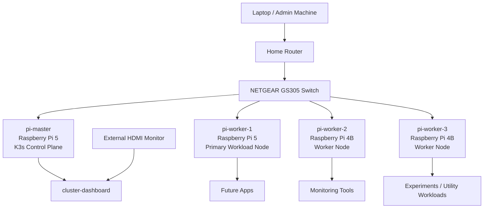

# Initial Architecture Diagram

## Overview

This diagram shows the initial logical architecture of the homelab cluster.

It is intentionally simple and represents the current planned system rather than the fully implemented final state.

## Rough Architecture Diagram

## Notes
- `pi-master` is planned as the K3s control plane node.
- Worker nodes will host applications, monitoring tools, and future experiments.
- The custom `cluster-dashboard` is planned as the main user-facing UI for the external monitor.
- Administration will primarily happen from a laptop over SSH and browser-based tools.